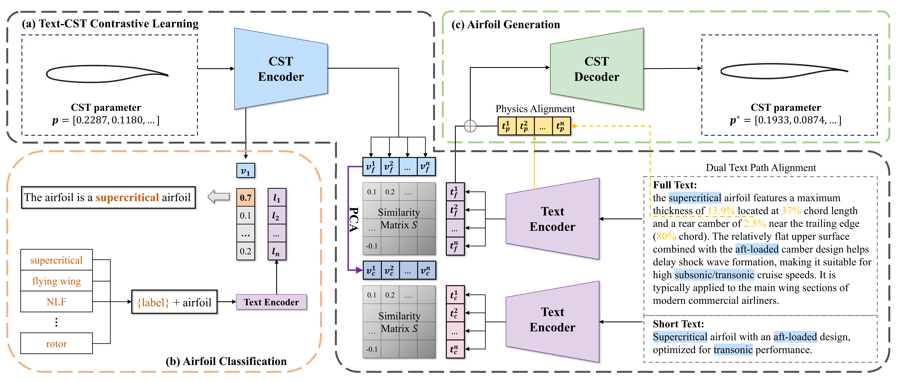

# FoilCLIP: Natural Language Interface for Airfoil Design

## Overview

FoilCLIP represents a novel framework for airfoil design using natural language interfaces, leveraging recent advances in contrastive language-image pretraining (CLIP) models and generative AI. This project establishes the first end-to-end, bidirectional mapping between textual descriptions (e.g., "low-drag supercritical wing for transonic conditions") and parametric airfoil geometries represented by Class-Shape Transformation (CST) parameters.

The framework integrates a CLIP-inspired architecture that aligns text embeddings with airfoil parameter spaces through contrastive learning, along with a semantic-conditioned decoder that produces physically plausible airfoil geometries from latent representations.

## Key Features

- **Natural Language to Airfoil:** Generate aerodynamically plausible airfoil geometries from textual descriptions
- **Airfoil to Text Classification:** Classify airfoils based on their aerodynamic properties and design characteristics
- **Cross-Modal Alignment:** Contrastive learning framework that aligns text embeddings with CST parameter spaces
- **Physics-Aware Generation:** Decoder ensures generated airfoils adhere to physical constraints and aerodynamic principles

## Model Architecture

The FoilCLIP architecture consists of:

1. **Text Encoder:** Processes natural language descriptions of airfoil requirements
2. **CST Parameter Encoder:** Encodes CST parameters that define airfoil geometries
3. **Contrastive Learning Framework:** Aligns text and parameter representations in a shared latent space
4. **Semantic-Conditioned Decoder:** Generates physically valid airfoil geometries from latent representations



## Environment Setup

This project relies on a DeepSpeed environment for model training and execution.
The installation and configuration of DeepSpeed can be complex and is system-dependent. Please refer to the official for detailed setup instructions.

## Dataset and Checkpoints

The dataset, consisting of airfoil geometries paired with descriptive texts (encoded using CST parameters), and pre-trained model checkpoints are available for download.
Due to their size, these files are not included in this GitHub repository.

You can download them from the following cloud drive link:
`[Download Dataset and Checkpoints](YOUR_CLOUD_DRIVE_LINK_HERE)`

Please place the dataset files in the `dataset/` directory (or update paths in configurations) and checkpoints in the `checkpoints/` directory (or as specified by the scripts).

## Usage

### Training

The model training is performed using `train.py`. You can configure the training process using a JSON configuration file and launch it with DeepSpeed.

**To run training:**
1. Prepare your DeepSpeed configuration file (e.g., `config.json`).
2. Execute the training script:
    ```bash
    deepspeed train.py [arguments...]
    ```
    Refer to `train.py` (e.g., by running `python train.py --help`) for a full list of available command-line arguments.

### Testing and Inference

The `test.py` script is provided for evaluating a trained model and performing inference. Please refer to the `test.py` script directly for details on its usage, arguments, and the specific tests it performs (e.g., text-to-CST generation, CST classification). The `test.sh` script also provides an example of test execution.

## Research and Results

Experimental results validate the framework's ability to generate aerodynamically plausible airfoils from natural language specifications and to classify airfoils accurately based on given textual labels. This research reduces the expertise threshold for preliminary airfoil design and highlights the potential for human-AI collaboration in aerospace engineering.

## Citation

If you use FoilCLIP in your research, please cite our work.

## License

This project is licensed under the MIT License - see the LICENSE file for details.

## Acknowledgments

We acknowledge the support from [Your Institution/Organization] and the contributions of the open-source community.